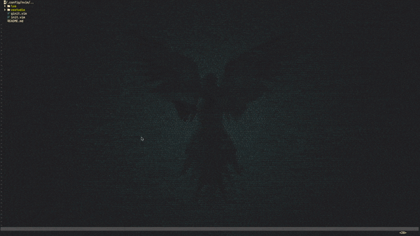

# nvim-lua

Migration of vimrc from .vim to .lua for csharp development in Win10 with Neovim.
Current configuration facilitates features like:

- folder and file navigation using telescope, nvim-tree
- code navigation using lsp-omnisharp, telescope
- warning, error info on statusline
- build using msbuild
- markdown documentation and preview

### Dependencies

- nodejs
- yarn
- ripgrep

Vim experience with VsVim extension config - vsstudio/vsvimrc
